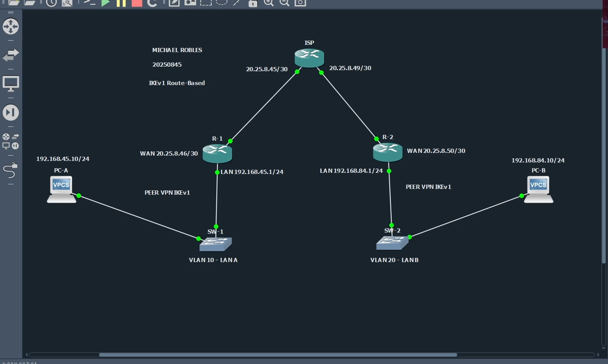
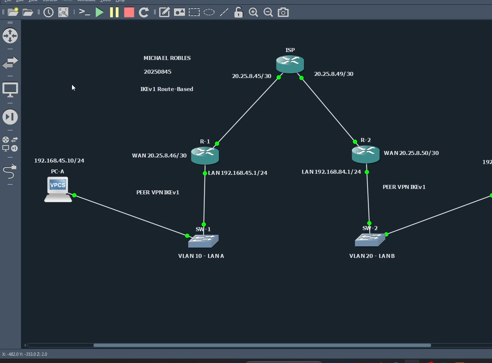
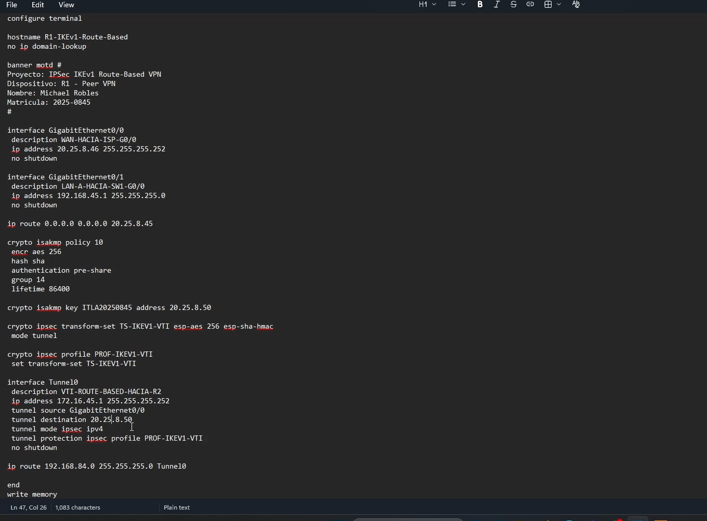
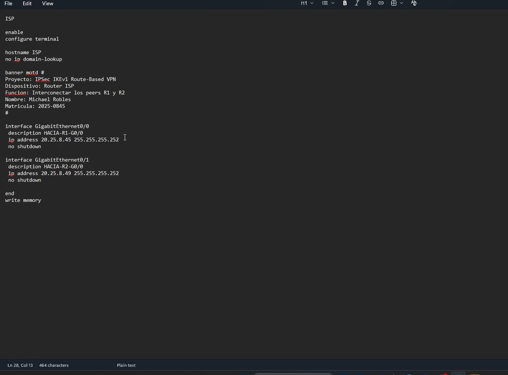
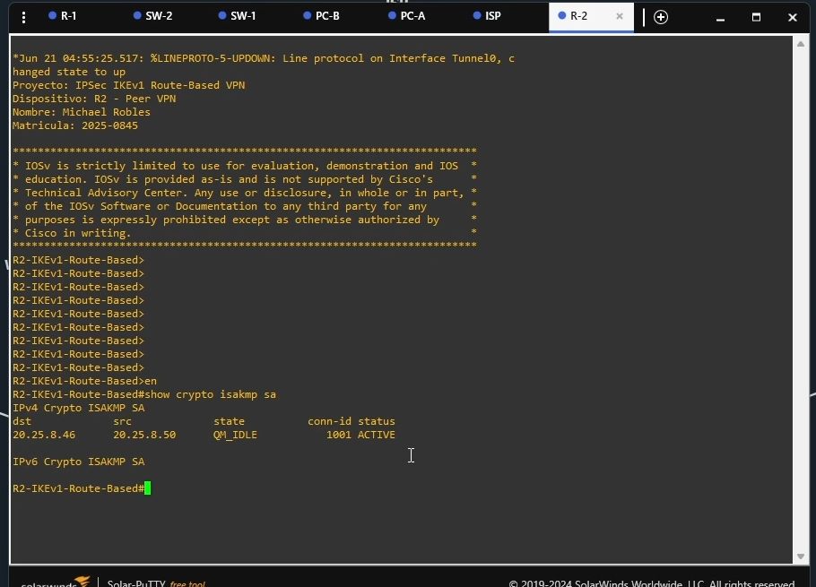
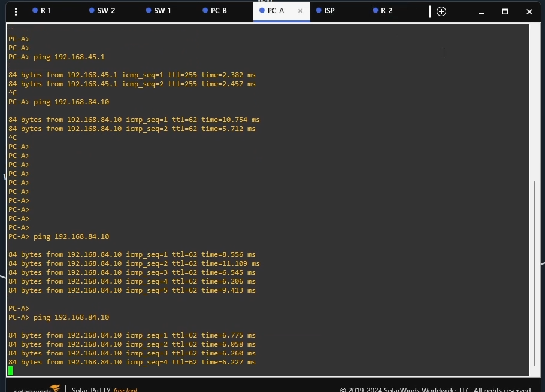
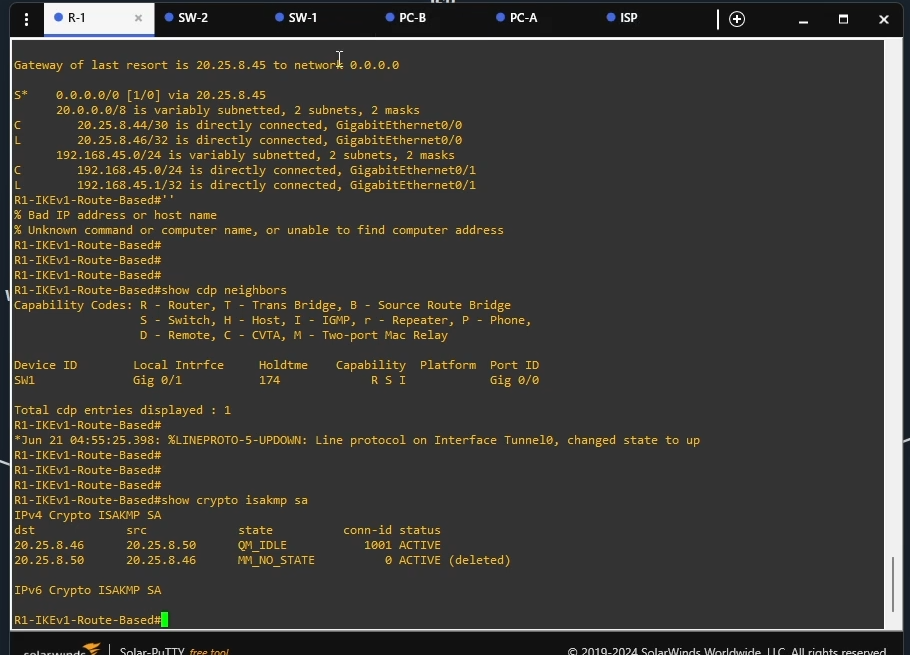
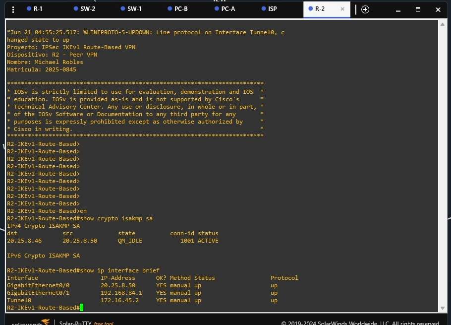

# VPN IPSec IKEv1 Site-to-Site Route-Based

---

## Información del proyecto

**Autor:** Michael David Robles Fermín  

**Matrícula:** 2025-0845  

**Práctica:** P3  

**Asignatura:** Seguridad de Redes  

**Repositorio:** https://github.com/iClexi/VPN-IKEv1-Route-Based  

**Video demostrativo:**  
https://youtu.be/Dkm7RHqRz5E?si=h4JCmfxSQYkSDoNK  

**Documentación técnica profesional:**  
[Ver documentación técnica profesional](docs/Documentacion%20Tecnica%20Profesional.pdf)

**Ubicación directa:** `docs/Documentacion Tecnica Profesional.pdf`

---

## Vista general de la topología

La práctica fue desarrollada en GNS3 usando una topología de VPN Site-to-Site. El diseño conecta dos redes LAN por medio de dos routers peers y un router ISP intermedio.

```text
PC-A --- SW1 --- R1 --- ISP --- R2 --- SW2 --- PC-B
```



En esta topología, **R1** y **R2** son los routers que forman la VPN. El router **ISP** solamente proporciona conectividad WAN entre ambos peers. El ISP no cifra tráfico ni participa en la negociación IKEv1/IPSec.

---

## Descripción general

Este repositorio contiene los scripts, evidencias y documentación de una **VPN IPSec IKEv1 Site-to-Site basada en enrutamiento**, también conocida como **Route-Based VPN**.

La finalidad es permitir que la LAN A y la LAN B se comuniquen de manera segura por medio de una interfaz virtual `Tunnel0` protegida con IPSec.

Las redes protegidas son:

```text
LAN A: 192.168.45.0/24
LAN B: 192.168.84.0/24
```

---

## Conceptos principales

### VPN

Una VPN permite crear una comunicación segura sobre una red que no necesariamente es segura, como Internet o una red de proveedor. En este laboratorio, la VPN protege el tráfico entre dos LANs.

### VPN Site-to-Site

Una VPN Site-to-Site conecta dos redes completas. En este caso, conecta la red detrás de R1 con la red detrás de R2.

### IPSec

IPSec es el conjunto de protocolos encargado de proteger el tráfico IP. Permite cifrado, autenticación e integridad.

### IKEv1

IKEv1 negocia los parámetros de seguridad entre R1 y R2 antes de que IPSec proteja el tráfico real. Cuando la negociación es correcta, se observa el estado `QM_IDLE ACTIVE`.

### Route-Based VPN

Esta VPN es basada en enrutamiento porque el tráfico entra al túnel usando la tabla de rutas. En lugar de depender de una ACL y un crypto map para seleccionar el tráfico, se crea una interfaz virtual `Tunnel0` protegida por IPSec.

La diferencia principal es:

```text
Policy-Based = ACL + crypto map
Route-Based = Tunnel0 + rutas
```

---

## Direccionamiento IP

| Dispositivo | Interfaz | Dirección IP | Función |
|---|---|---|---|
| PC-A | e0 | 192.168.45.10/24 | Host de la LAN A |
| R1 | Gi0/1 | 192.168.45.1/24 | Gateway de la LAN A |
| R1 | Gi0/0 | 20.25.8.46/30 | WAN / Peer VPN |
| R1 | Tunnel0 | 172.16.45.1/30 | Interfaz VTI del túnel |
| ISP | Gi0/0 | 20.25.8.45/30 | Enlace hacia R1 |
| ISP | Gi0/1 | 20.25.8.49/30 | Enlace hacia R2 |
| R2 | Gi0/0 | 20.25.8.50/30 | WAN / Peer VPN |
| R2 | Gi0/1 | 192.168.84.1/24 | Gateway de la LAN B |
| R2 | Tunnel0 | 172.16.45.2/30 | Interfaz VTI del túnel |
| PC-B | e0 | 192.168.84.10/24 | Host de la LAN B |

---

## VLANs utilizadas

| Switch | VLAN | Nombre | Uso |
|---|---:|---|---|
| SW1 | 10 | LAN_A | Segmento de PC-A y R1 |
| SW2 | 20 | LAN_B | Segmento de PC-B y R2 |

Las VLANs organizan cada red local. La VPN se configura en los routers, no en los switches.

---

## Parámetros de la VPN

| Parámetro | Valor |
|---|---|
| Tipo de VPN | IPSec Site-to-Site |
| Modo | Route-Based |
| Versión IKE | IKEv1 |
| Autenticación | Pre-Shared Key |
| Clave precompartida | ITLA20250845 |
| Cifrado IKE | AES 256 |
| Hash | SHA |
| Diffie-Hellman | Grupo 14 |
| Lifetime | 86400 segundos |
| Transform Set | TS-IKEV1-VTI |
| IPSec Profile | PROF-IKEV1-VTI |
| Interfaz del túnel | Tunnel0 |
| Red del túnel | 172.16.45.0/30 |

---

## Estructura del repositorio

```text
VPN-IKEv1-Route-Based/
├── docs/
│   ├── Documentacion Tecnica Profesional.pdf
│   ├── MichaelRobles_2025-0845_Documentacion-Tecnica-Profesional-VPN-IKEv1-Route-Based_P3.docx
│   └── MichaelRobles_2025-0845_Documentacion-Tecnica-Profesional-VPN-IKEv1-Route-Based_P3.pdf
├── images/
│   ├── 01_topologia_general_nombre_matricula.png
│   ├── 02_configuracion_R1_crypto_tunnel_rutas.png
│   ├── 03_configuracion_R2_crypto_tunnel_rutas.png
│   ├── 04_configuracion_ISP_wan.png
│   ├── 05_configuracion_SW1_vlan10.png
│   ├── 06_PC-A_show_ip_ping_remoto.png
│   ├── 07_PC-A_ping_remoto_completo.png
│   ├── 08_R1_isakmp_tunnel_up_up.png
│   └── 09_R2_isakmp_interface_brief.png
├── scripts/
│   ├── ISP.cfg
│   ├── PC-A.cfg
│   ├── PC-B.cfg
│   ├── R1-IKEv1-Route-Based.cfg
│   ├── R2-IKEv1-Route-Based.cfg
│   ├── SW1.cfg
│   ├── SW2.cfg
│   └── Verification-Commands.txt
├── video/
│   └── Video-Link.txt
├── Links_Video_Repositorio.txt
└── README.md
```

---

## Explicación de los scripts

### R1-IKEv1-Route-Based.cfg

R1 funciona como el peer VPN del lado izquierdo. En este equipo se configura la interfaz WAN, la interfaz LAN, la política IKEv1, el transform-set IPSec, el perfil IPSec y la interfaz `Tunnel0`.

La ruta hacia la LAN B se envía por el túnel:

```cisco
ip route 192.168.84.0 255.255.255.0 Tunnel0
```

### R2-IKEv1-Route-Based.cfg

R2 funciona como el peer VPN del lado derecho. Tiene una configuración equivalente a R1, pero apuntando hacia la IP WAN de R1.

La ruta hacia la LAN A se envía por el túnel:

```cisco
ip route 192.168.45.0 255.255.255.0 Tunnel0
```

### ISP.cfg

El ISP solo interconecta las WAN de R1 y R2. No tiene configuración VPN.

### SW1.cfg y SW2.cfg

SW1 organiza la LAN A en la VLAN 10. SW2 organiza la LAN B en la VLAN 20.

### PC-A.cfg y PC-B.cfg

PC-A y PC-B se usan para validar la conectividad entre las redes LAN por medio de la VPN.

---

## Funcionamiento técnico

El funcionamiento general es el siguiente:

1. PC-A intenta comunicarse con PC-B.
2. R1 recibe el tráfico de la LAN A.
3. R1 revisa su tabla de rutas.
4. La ruta hacia `192.168.84.0/24` apunta a `Tunnel0`.
5. Tunnel0 está protegido con el perfil IPSec `PROF-IKEV1-VTI`.
6. El tráfico viaja cifrado a través del ISP.
7. R2 recibe el tráfico, lo descifra y lo entrega a la LAN B.
8. La respuesta de PC-B vuelve protegida en sentido contrario.

---

## Evidencias principales

### Topología general


### Configuración de R1



### Configuración de R2



### Configuración del ISP



### Configuración de SW1


### Ping desde PC-A hacia PC-B



### Ping completo desde PC-A hacia PC-B



### R1 con IKEv1 activo y Tunnel0 up/up



### R2 con IKEv1 activo e interfaces up/up



---

## Comandos de verificación

En routers:

```cisco
show ip interface brief
show running-config interface Tunnel0
show running-config | section crypto
show ip route
show crypto isakmp sa
show crypto ipsec sa
```

En las PCs:

```bash
show ip
ping 192.168.84.10
ping 192.168.45.10
```

---

## Resultado esperado

La VPN debe mostrar IKEv1 en estado:

```text
QM_IDLE ACTIVE
```

`Tunnel0` debe estar en estado:

```text
up/up
```

Además, PC-A debe poder hacer ping hacia PC-B y viceversa.

---

## Documentación técnica profesional

La documentación completa está disponible en:

[Ver documentación técnica profesional](docs/Documentacion%20Tecnica%20Profesional.pdf)

También se encuentra directamente en:

```text
docs/Documentacion Tecnica Profesional.pdf
```

---

## Video demostrativo

El video demostrativo de esta práctica está disponible en:

https://youtu.be/Dkm7RHqRz5E?si=h4JCmfxSQYkSDoNK

---

## Conclusión

La VPN IPSec IKEv1 Site-to-Site Route-Based fue configurada y verificada correctamente. La comunicación entre las redes `192.168.45.0/24` y `192.168.84.0/24` se realizó por medio de `Tunnel0`, protegido con IPSec. Las evidencias muestran conectividad entre las PCs y estado `QM_IDLE ACTIVE` en IKEv1, confirmando el funcionamiento correcto de la VPN basada en enrutamiento.
