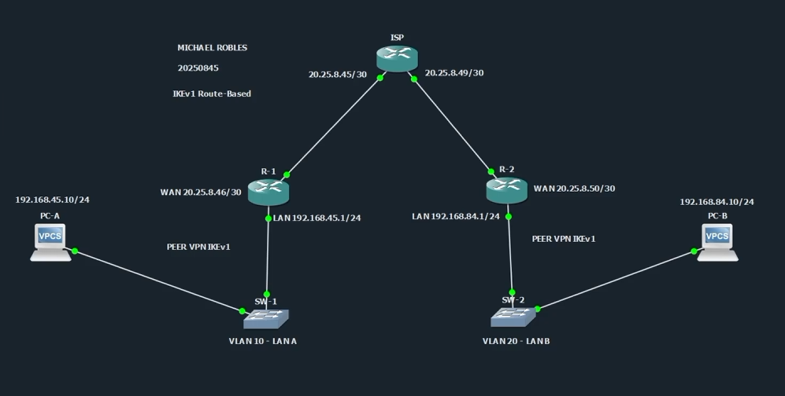
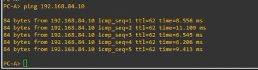
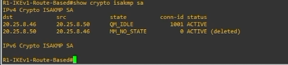
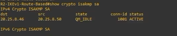
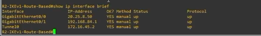
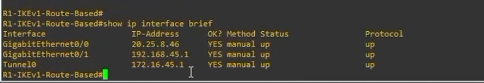

# VPN IPSec IKEv1 Site-to-Site Route-Based


---

## Información del proyecto

**Autor:** Michael David Robles Fermín  

**Matrícula:** 2025-0845  

**Asignatura:** Seguridad de Redes  

**Repositorio:** https://github.com/iClexi/VPN-IKEv1-Route-Based  

**Video demostrativo:**  
https://youtu.be/Dkm7RHqRz5E?si=h4JCmfxSQYkSDoNK  

**Documentación técnica profesional:**  
[Ver documentación técnica profesional](docs/Documentacion%20Tecnica%20Profesional.pdf)  

**Ubicación directa:** `docs/Documentacion Tecnica Profesional.pdf`

---

## Vista general de la topología

La práctica fue desarrollada en GNS3 con una topología de VPN Site-to-Site. El diseño conecta dos redes LAN por medio de dos routers peers y un router ISP intermedio.

```text
PC-A --- SW1 --- R1 --- ISP --- R2 --- SW2 --- PC-B
```



En esta topología, **R1** y **R2** son los routers que forman la VPN. El router **ISP** solamente proporciona conectividad entre ambos peers, simulando una red pública o proveedor de servicios. El ISP no cifra tráfico ni participa en la negociación de la VPN.

---

## Descripción general

Este repositorio contiene los scripts, evidencias, documentación y video demostrativo de una **VPN IPSec IKEv1 Site-to-Site basada en enrutamiento**.

El objetivo principal es permitir que dos redes LAN diferentes puedan comunicarse de forma segura por medio de IPSec. En este caso, la LAN A se encuentra detrás de R1 y la LAN B se encuentra detrás de R2.

La comunicación protegida ocurre entre:

```text
LAN A: 192.168.45.0/24
LAN B: 192.168.84.0/24
```

A diferencia de una VPN basada en políticas, en esta VPN el tráfico entra al túnel mediante una ruta. Para eso se utiliza una interfaz virtual llamada `Tunnel0`.

---

## Objetivo del laboratorio

El objetivo de este laboratorio es configurar y demostrar el funcionamiento de una VPN IPSec IKEv1 Site-to-Site basada en enrutamiento.

Para cumplir esto se implementó:

- Una topología con dos routers peers.
- Un router ISP como red intermedia.
- Una LAN en cada extremo.
- Configuración IPSec con IKEv1.
- Una interfaz virtual `Tunnel0`.
- Un perfil IPSec aplicado al túnel.
- Rutas estáticas hacia las redes remotas por medio del túnel.
- Pruebas de conectividad entre PC-A y PC-B.
- Verificación de IKEv1 e interfaces mediante comandos show.

---

## Conceptos utilizados

### VPN

Una VPN, o red privada virtual, permite crear una comunicación segura sobre una red que no necesariamente es segura, como Internet. Su función principal es proteger el tráfico mediante cifrado, autenticación e integridad.

### VPN Site-to-Site

Una VPN Site-to-Site conecta dos redes completas entre sí. En este laboratorio no se conecta un cliente individual, sino dos LANs completas:

- La LAN A detrás de R1.
- La LAN B detrás de R2.

Esto simula el caso de dos sucursales que necesitan comunicarse de forma segura.

### IPSec

IPSec es el conjunto de protocolos encargado de proteger el tráfico IP. En este laboratorio, IPSec cifra el tráfico que viaja entre PC-A y PC-B.

IPSec permite:

- Cifrado del tráfico.
- Verificación de integridad.
- Autenticación de los peers.
- Protección de la comunicación entre redes.

### IKEv1

IKEv1 es el protocolo encargado de negociar los parámetros de seguridad antes de que IPSec proteja el tráfico real.

En este laboratorio, R1 y R2 negocian:

- Cifrado AES 256.
- Hash SHA.
- Autenticación por clave precompartida.
- Grupo Diffie-Hellman 14.
- Tiempo de vida de la negociación.

Cuando la VPN está correctamente levantada, el estado aparece como:

```text
QM_IDLE ACTIVE
```

### VPN basada en enrutamiento

Esta VPN es basada en enrutamiento porque el tráfico que será protegido entra al túnel mediante la tabla de rutas.

En este laboratorio se usa una interfaz virtual:

```text
Tunnel0
```

R1 tiene una ruta hacia la LAN B por `Tunnel0`, y R2 tiene una ruta hacia la LAN A por `Tunnel0`.

La idea principal es:

```text
Policy-Based = ACL + Crypto Map
Route-Based = Tunnel0 + Rutas
```

---

## Direccionamiento IP

| Dispositivo | Interfaz | Dirección IP | Función |
|---|---|---|---|
| PC-A | e0 | 192.168.45.10/24 | Host de la LAN A |
| R1 | Gi0/1 | 192.168.45.1/24 | Gateway de la LAN A |
| R1 | Gi0/0 | 20.25.8.46/30 | WAN / Peer VPN |
| R1 | Tunnel0 | 172.16.45.1/30 | Interfaz virtual del túnel |
| ISP | Gi0/0 | 20.25.8.45/30 | Enlace hacia R1 |
| ISP | Gi0/1 | 20.25.8.49/30 | Enlace hacia R2 |
| R2 | Gi0/0 | 20.25.8.50/30 | WAN / Peer VPN |
| R2 | Gi0/1 | 192.168.84.1/24 | Gateway de la LAN B |
| R2 | Tunnel0 | 172.16.45.2/30 | Interfaz virtual del túnel |
| PC-B | e0 | 192.168.84.10/24 | Host de la LAN B |

La red `172.16.45.0/30` se utiliza solamente para el túnel. No pertenece a la LAN ni al ISP. Su función es identificar el enlace lógico entre R1 y R2.

---

## VLANs utilizadas

Aunque la VPN se configura en los routers, los switches organizan cada red local mediante VLANs.

| Switch | VLAN | Nombre | Uso |
|---|---:|---|---|
| SW1 | 10 | LAN_A | Segmento de PC-A y R1 |
| SW2 | 20 | LAN_B | Segmento de PC-B y R2 |

La función de estas VLANs es mantener cada LAN organizada en su propio segmento de capa 2.

---

## Parámetros de la VPN

| Parámetro | Valor |
|---|---|
| Tipo de VPN | IPSec Site-to-Site |
| Versión IKE | IKEv1 |
| Diseño | Route-Based |
| Autenticación | Pre-Shared Key |
| Clave precompartida | ITLA20250845 |
| Cifrado IKE | AES 256 |
| Hash | SHA |
| Diffie-Hellman | Grupo 14 |
| Lifetime | 86400 segundos |
| Transform Set | TS-IKEV1-VTI |
| Protección IPSec | ESP-AES 256 + ESP-SHA-HMAC |
| Modo IPSec | Tunnel |
| IPSec Profile | PROF-IKEV1-VTI |
| Interfaz virtual | Tunnel0 |
| Red del túnel | 172.16.45.0/30 |

---

## Estructura del repositorio

```text
VPN-IKEv1-Route-Based/
├── docs/
│   ├── MichaelRobles_2025-0845_Documentacion-Tecnica-Profesional-VPN-IKEv1-Route-Based_P3.docx
│   └── MichaelRobles_2025-0845_Documentacion-Tecnica-Profesional-VPN-IKEv1-Route-Based_P3.pdf
├── images/
│   ├── MichaelRobles_2025-0845_01-Topologia-General_P3.png
│   ├── MichaelRobles_2025-0845_02-PC-A-Ping-PC-B_P3.png
│   ├── MichaelRobles_2025-0845_03-R1-Show-Crypto-ISAKMP-SA_P3.png
│   ├── MichaelRobles_2025-0845_04-R2-Show-Crypto-ISAKMP-SA_P3.png
│   ├── MichaelRobles_2025-0845_05-R2-Show-IP-Interface-Brief_P3.png
│   └── MichaelRobles_2025-0845_06-R1-Show-IP-Interface-Brief_P3.png
├── scripts/
│   ├── MichaelRobles_2025-0845_R1-IKEv1-Route-Based_P3.cfg
│   ├── MichaelRobles_2025-0845_R2-IKEv1-Route-Based_P3.cfg
│   ├── MichaelRobles_2025-0845_ISP_P3.cfg
│   ├── MichaelRobles_2025-0845_SW1_P3.cfg
│   ├── MichaelRobles_2025-0845_SW2_P3.cfg
│   ├── MichaelRobles_2025-0845_PC-A_P3.cfg
│   ├── MichaelRobles_2025-0845_PC-B_P3.cfg
│   └── MichaelRobles_2025-0845_Verification-Commands_P3.txt
├── video/
│   └── MichaelRobles_2025-0845_Links-Video-Repositorio_P3.txt
├── MichaelRobles_2025-0845_Links-Video-Repositorio_P3.txt
└── README.md
```

---

## Tutorial de configuración

Esta sección explica cómo se configuró el laboratorio y qué función cumple cada bloque de comandos.

### 1. Configuración básica de R1 y R2

En ambos routers se configuró el nombre del dispositivo y se desactivó la búsqueda DNS automática:

```cisco
hostname R1-IKEv1-Route-Based
no ip domain-lookup
```

El comando `hostname` identifica el equipo dentro del laboratorio.  
El comando `no ip domain-lookup` evita que el router intente resolver como dominio cualquier comando escrito incorrectamente.

---

### 2. Configuración de interfaces WAN y LAN

En R1 se configuró la interfaz WAN hacia el ISP:

```cisco
interface GigabitEthernet0/0
 description WAN-HACIA-ISP-G0/0
 ip address 20.25.8.46 255.255.255.252
 no shutdown
```

También se configuró la interfaz LAN como gateway de PC-A:

```cisco
interface GigabitEthernet0/1
 description LAN-A-HACIA-SW1-G0/0
 ip address 192.168.45.1 255.255.255.0
 no shutdown
```

En R2 se configuró la WAN y la LAN del lado derecho:

```cisco
interface GigabitEthernet0/0
 description WAN-HACIA-ISP-G0/1
 ip address 20.25.8.50 255.255.255.252
 no shutdown

interface GigabitEthernet0/1
 description LAN-B-HACIA-SW2-G0/0
 ip address 192.168.84.1 255.255.255.0
 no shutdown
```

---

### 3. Configuración de rutas por defecto

En R1 se configuró una ruta por defecto hacia el ISP:

```cisco
ip route 0.0.0.0 0.0.0.0 20.25.8.45
```

En R2 se configuró una ruta por defecto hacia el ISP:

```cisco
ip route 0.0.0.0 0.0.0.0 20.25.8.49
```

Estas rutas permiten que R1 y R2 puedan alcanzar las IP WAN remotas a través del ISP.

---

### 4. Configuración de IKEv1

En ambos routers se configuró la política IKEv1:

```cisco
crypto isakmp policy 10
 encr aes 256
 hash sha
 authentication pre-share
 group 14
 lifetime 86400
```

Este bloque define los parámetros de negociación inicial de la VPN:

- `encr aes 256`: usa AES de 256 bits para cifrado.
- `hash sha`: usa SHA para integridad.
- `authentication pre-share`: usa clave precompartida.
- `group 14`: usa Diffie-Hellman grupo 14.
- `lifetime 86400`: define el tiempo de vida de la asociación de seguridad.

---

### 5. Configuración de clave precompartida

En R1 se configuró la clave precompartida apuntando a R2:

```cisco
crypto isakmp key ITLA20250845 address 20.25.8.50
```

En R2 se configuró la misma clave apuntando a R1:

```cisco
crypto isakmp key ITLA20250845 address 20.25.8.46
```

Ambos routers deben usar la misma clave para autenticarse correctamente.

---

### 6. Configuración del transform-set IPSec

En ambos routers se configuró el transform-set:

```cisco
crypto ipsec transform-set TS-IKEV1-VTI esp-aes 256 esp-sha-hmac
 mode tunnel
```

Este bloque define cómo IPSec protege el tráfico real.

---

### 7. Configuración del IPSec profile

En ambos routers se creó un perfil IPSec:

```cisco
crypto ipsec profile PROF-IKEV1-VTI
 set transform-set TS-IKEV1-VTI
```

Este perfil permite aplicar la protección IPSec directamente sobre la interfaz `Tunnel0`.

---

### 8. Configuración de Tunnel0 en R1

En R1 se creó la interfaz virtual del túnel:

```cisco
interface Tunnel0
 description VTI-ROUTE-BASED-HACIA-R2
 ip address 172.16.45.1 255.255.255.252
 tunnel source GigabitEthernet0/0
 tunnel destination 20.25.8.50
 tunnel mode ipsec ipv4
 tunnel protection ipsec profile PROF-IKEV1-VTI
 no shutdown
```

Este bloque hace varias cosas:

- `ip address 172.16.45.1 255.255.255.252`: asigna una IP lógica al túnel.
- `tunnel source GigabitEthernet0/0`: indica que el túnel sale desde la WAN de R1.
- `tunnel destination 20.25.8.50`: indica que el túnel termina en la WAN de R2.
- `tunnel mode ipsec ipv4`: define que el túnel será una VTI IPSec.
- `tunnel protection ipsec profile PROF-IKEV1-VTI`: aplica IPSec al túnel.

---

### 9. Configuración de Tunnel0 en R2

En R2 se creó la interfaz virtual del túnel en sentido contrario:

```cisco
interface Tunnel0
 description VTI-ROUTE-BASED-HACIA-R1
 ip address 172.16.45.2 255.255.255.252
 tunnel source GigabitEthernet0/0
 tunnel destination 20.25.8.46
 tunnel mode ipsec ipv4
 tunnel protection ipsec profile PROF-IKEV1-VTI
 no shutdown
```

R2 usa como destino la WAN de R1, que es `20.25.8.46`.

---

### 10. Configuración de rutas hacia las LAN remotas

En R1 se configuró una ruta hacia la LAN B por el túnel:

```cisco
ip route 192.168.84.0 255.255.255.0 Tunnel0
```

En R2 se configuró una ruta hacia la LAN A por el túnel:

```cisco
ip route 192.168.45.0 255.255.255.0 Tunnel0
```

Estas rutas son la base de la VPN Route-Based. El tráfico entra al túnel porque la tabla de rutas indica que la red remota se alcanza por `Tunnel0`.

---

### 11. Configuración del ISP

El ISP solo tiene direccionamiento en sus interfaces. No tiene configuración de VPN:

```cisco
interface GigabitEthernet0/0
 description HACIA-R1-G0/0
 ip address 20.25.8.45 255.255.255.252
 no shutdown

interface GigabitEthernet0/1
 description HACIA-R2-G0/0
 ip address 20.25.8.49 255.255.255.252
 no shutdown
```

El ISP solamente permite conectividad entre R1 y R2.

---

### 12. Configuración de switches

En SW1 se configuró la VLAN 10 para la LAN A:

```cisco
vlan 10
 name LAN_A
```

Los puertos hacia R1 y PC-A se pusieron en modo access dentro de la VLAN 10.

En SW2 se configuró la VLAN 20 para la LAN B:

```cisco
vlan 20
 name LAN_B
```

Los puertos hacia R2 y PC-B se pusieron en modo access dentro de la VLAN 20.

---

### 13. Configuración de PCs

PC-A se configuró con:

```text
ip 192.168.45.10 255.255.255.0 192.168.45.1
```

PC-B se configuró con:

```text
ip 192.168.84.10 255.255.255.0 192.168.84.1
```

Cada PC usa como gateway la interfaz LAN del router de su lado.

---

## Explicación de los scripts

### R1-IKEv1-Route-Based.cfg

El script de R1 configura el router del lado izquierdo como peer VPN.

En R1 se configura:

- La interfaz WAN hacia el ISP con la IP `20.25.8.46/30`.
- La interfaz LAN con la IP `192.168.45.1/24`.
- Una ruta por defecto hacia el ISP.
- La política IKEv1.
- La clave precompartida hacia R2.
- El transform-set IPSec.
- El IPSec profile.
- La interfaz `Tunnel0`.
- La ruta hacia la LAN B por el túnel.

R1 envía el tráfico hacia `192.168.84.0/24` por `Tunnel0`.

### R2-IKEv1-Route-Based.cfg

El script de R2 configura el router del lado derecho como segundo peer VPN.

En R2 se configura:

- La interfaz WAN hacia el ISP con la IP `20.25.8.50/30`.
- La interfaz LAN con la IP `192.168.84.1/24`.
- Una ruta por defecto hacia el ISP.
- La misma política IKEv1 usada por R1.
- La clave precompartida hacia R1.
- El transform-set IPSec.
- El IPSec profile.
- La interfaz `Tunnel0`.
- La ruta hacia la LAN A por el túnel.

R2 envía el tráfico hacia `192.168.45.0/24` por `Tunnel0`.

### ISP.cfg

El router ISP solamente conecta a R1 con R2.

El ISP no contiene configuración de VPN, no usa ISAKMP y no cifra tráfico. Su función es simular la red intermedia.

### SW1.cfg y SW2.cfg

SW1 contiene la VLAN 10 para la LAN A.  
SW2 contiene la VLAN 20 para la LAN B.

Ambos switches trabajan como switches de acceso.

### PC-A.cfg y PC-B.cfg

PC-A se configura con:

```text
IP: 192.168.45.10/24
Gateway: 192.168.45.1
```

PC-B se configura con:

```text
IP: 192.168.84.10/24
Gateway: 192.168.84.1
```

Estas PCs se utilizan para validar la comunicación entre ambas LANs.

---

## Funcionamiento técnico

El funcionamiento general de la VPN es el siguiente:

1. PC-A intenta comunicarse con PC-B.
2. El tráfico llega a R1.
3. R1 revisa su tabla de rutas.
4. R1 encuentra que la red `192.168.84.0/24` sale por `Tunnel0`.
5. Como `Tunnel0` está protegido con IPSec, el tráfico entra al túnel.
6. R1 y R2 negocian los parámetros de seguridad usando IKEv1.
7. IPSec cifra el tráfico.
8. El tráfico viaja cifrado a través del ISP.
9. R2 recibe el tráfico, lo descifra y lo entrega a PC-B.
10. La respuesta de PC-B vuelve protegida en sentido contrario.

---

## Evidencias

### Topología general


La topología muestra los dos peers VPN, el router ISP y una LAN en cada extremo.

### Ping desde PC-A hacia PC-B



Esta prueba demuestra conectividad desde la LAN A hacia la LAN B.

### Estado IKEv1 en R1



El estado `QM_IDLE ACTIVE` confirma que la negociación IKEv1 se completó correctamente en R1.

### Estado IKEv1 en R2



R2 también muestra `QM_IDLE ACTIVE`, confirmando que ambos peers tienen la VPN levantada.

### Interfaces de R2



Se confirma que R2 tiene activas la interfaz WAN `20.25.8.50/30`, la interfaz LAN `192.168.84.1/24` y `Tunnel0` con la IP `172.16.45.2/30`.

### Interfaces de R1



Se confirma que R1 tiene activas la interfaz WAN `20.25.8.46/30`, la interfaz LAN `192.168.45.1/24` y `Tunnel0` con la IP `172.16.45.1/30`.

---

## Comandos de verificación

En routers:

```cisco
show clock
show ip interface brief
show running-config interface Tunnel0
show running-config | section crypto
show crypto isakmp sa
show crypto ipsec sa
show ip route
```

En PCs:

```bash
show ip
ping 192.168.84.10
ping 192.168.45.10
```

---

## Resultado esperado

La VPN debe aparecer activa mediante el comando:

```cisco
show crypto isakmp sa
```

Resultado esperado:

```text
QM_IDLE ACTIVE
```

La interfaz del túnel debe aparecer activa:

```text
Tunnel0    172.16.45.1    up    up
Tunnel0    172.16.45.2    up    up
```

También deben observarse rutas hacia las redes remotas por `Tunnel0`.

Esto confirma que la VPN no solo está configurada, sino que está enviando tráfico por una interfaz virtual protegida con IPSec.

---

## Documentación técnica profesional

La documentación completa está disponible en el siguiente enlace interno del repositorio:

[Ver documentación técnica profesional](docs/MichaelRobles_2025-0845_Documentacion-Tecnica-Profesional-VPN-IKEv1-Route-Based_P3.pdf)

También se encuentra directamente en la siguiente ubicación dentro del repositorio:

```text
docs/MichaelRobles_2025-0845_Documentacion-Tecnica-Profesional-VPN-IKEv1-Route-Based_P3.pdf
```

---

## Conclusión

La VPN IPSec IKEv1 Site-to-Site basada en enrutamiento fue configurada correctamente. R1 y R2 funcionaron como peers VPN, el ISP actuó como red intermedia y las redes `192.168.45.0/24` y `192.168.84.0/24` lograron comunicarse de forma segura.

Las evidencias muestran que IKEv1 alcanzó el estado `QM_IDLE ACTIVE`, que `Tunnel0` quedó en estado `up/up` y que PC-A pudo comunicarse con PC-B. Esto confirma que la comunicación entre ambas LANs fue protegida correctamente mediante una VPN Route-Based.
